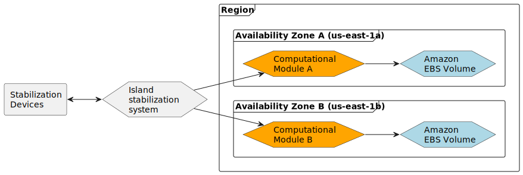

# Cloud First Steps

## Target
Create Amazon EC2 instances to run the computational modules for the island stabilization system.
Each instance should be placed in a different Availability Zone the the same Region.

## Infra Structure



## Analyse

According to the diagram, the following resources are present:

* 1 VPC per region
* 2 subnets, each containing an EC2 instance with 1 EBS volume
* The 2 EC2 instances are connected to the internet and need to be in public subnets, so an internet gateway needs to be created and added to the VPC's route table
* To ensure that only traffic on port 80 is allowed to reach the instances from the outside, a security group should be defined

## Steps

### Create file structures for terraform
* main.tf: contains resources
* variables.tf
* outputs.tf

### Create folder `lab_files` and put all lab files there

```
lab_files/
  user-data
```

### Setup AWS Provider
```terraform
# main.tf
terraform {
  # https://registry.terraform.io/providers/hashicorp/aws/latest/docs
  required_providers {
    aws = {
      source  = "hashicorp/aws"
      version = "~> 4.16"
    }
  }

  required_version = ">= 1.2.0"
}

provider "aws" {
  region  = "us-west-1"
  # access key and secret key will be read automatically by environment variables: AWS_ACCESS_KEY_ID, AWS_SECRET_ACCESS_KEY
}
```

### Create VPC, Internet Gateway and Route table

```terraform
# main.tf
# https://registry.terraform.io/providers/hashicorp/aws/latest/docs/resources/vpc
resource "aws_vpc" "main" {
  cidr_block = "10.0.0.0/16"
  enable_dns_hostnames = true

  tags = {
    Name = "main-vpc"
  }
}

# https://registry.terraform.io/providers/hashicorp/aws/latest/docs/data-sources/internet_gateway
resource "aws_internet_gateway" "main" {
  vpc_id = aws_vpc.main.id

  tags = {
    Name = "main"
  }
}

# https://registry.terraform.io/providers/hashicorp/aws/latest/docs/resources/route_table
resource "aws_route_table" "main" {
  vpc_id = aws_vpc.main.id

  route {
    cidr_block = "0.0.0.0/0"
    gateway_id = aws_internet_gateway.main.id
  }

  tags = {
    Name = "main"
  }
}
```

### Create 2 subnet for 2 instance and associate route table to subnet

```terraform
# main.tf
resource "aws_subnet" "east-1a" {
  vpc_id            = aws_vpc.main.id
  cidr_block        = "10.0.10.0/24"
  availability_zone = "us-east-1a"
  map_public_ip_on_launch = true # to make subnet public

  tags = {
    Name = "east-1a-subnet"
  }
}

resource "aws_subnet" "east-1b" {
  vpc_id            = aws_vpc.main.id
  cidr_block        = "10.0.20.0/24"
  availability_zone = "us-east-1b"
  map_public_ip_on_launch = true # to make subnet public

  tags = {
    Name = "east-1b-subnet"
  }
}

resource "aws_route_table_association" "east-1a" {
  subnet_id      = aws_subnet.east-1a.id
  route_table_id = aws_route_table.main.id
}

resource "aws_route_table_association" "east-1b" {
  subnet_id      = aws_subnet.east-1b.id
  route_table_id = aws_route_table.main.id
}
```

### Define AMI id for web instance
```terraform
# variables.tf
variable "ec2_ami_id" {
  type = string
  default = "ami-0b5eea76982371e91" 
  # name: amzn2-ami-kernel-5.10-hvm-2.0.20221210.1-x86_64-gp2
  # desc: Amazon Linux 2 Kernel 5.10 AMI 2.0.20221210.1 x86_64 HVM gp2
}
```

### Create 2 webinstance

```terraform
# main.tf
# https://registry.terraform.io/providers/hashicorp/aws/latest/docs/resources/instance
resource "aws_instance" "webserver01" {
  ami           = var.ec2_ami_id
  instance_type = "t2.micro"
  subnet_id = aws_subnet.east-1a.id
  associate_public_ip_address = true # to generate public ip & dns

  user_data = file("${path.module}/lab_files/user-data")

  tags = {
    Name = "webserver01"
  }
}

resource "aws_instance" "webserver02" {
  ami           = var.ec2_ami_id
  instance_type = "t2.micro"
  subnet_id = aws_subnet.east-1b.id
  associate_public_ip_address = true # to generate public ip & dns

  user_data = file("${path.module}/lab_files/user-data")

  tags = {
    Name = "webserver02"
  }
}
```

### Define security group

```terraform
# main.tf
# https://registry.terraform.io/providers/hashicorp/aws/latest/docs/resources/security_group
resource "aws_security_group" "security-group-lab" {
  name        = "Security-Group-Lab"
  description = "HTTP Security Group"
  vpc_id      = aws_vpc.main.id

  ingress {
    from_port   = 80
    to_port     = 80
    protocol    = "tcp"
    cidr_blocks = ["0.0.0.0/0"]
  }

  egress {
    from_port   = 0
    to_port     = 0
    protocol    = "-1"
    cidr_blocks = ["0.0.0.0/0"]
  }


  tags = {
    Name = "Security-Group-Lab"
  }
}
```

### Assign security group to webinstance

```terraform
# main.tf
data "aws_instance" "webserver01" {
  instance_id = aws_instance.webserver01.id
}

data "aws_instance" "webserver02" {
  instance_id = aws_instance.webserver02.id
}

resource "aws_network_interface_sg_attachment" "sg_attachment" {
  security_group_id    = aws_security_group.security-group-lab.id
  network_interface_id = data.aws_instance.webserver01.network_interface_id
}

resource "aws_network_interface_sg_attachment" "sg_attachment_web02" {
  security_group_id    = aws_security_group.security-group-lab.id
  network_interface_id = data.aws_instance.webserver02.network_interface_id
}
```

### Clear rule in default security group
```terraform
# main.tf
resource "aws_default_security_group" "default" {
  vpc_id = aws_vpc.main.id
}
```

### Output public dns of 2 webinstance
```terraform
# outputs.tf
output "public_dns_webserver01" {
    value = aws_instance.webserver01.public_dns
}

output "public_dns_webserver02" {
    value = aws_instance.webserver02.public_dns
}
```

### Provision Infrastructure

* Initialize the Terraform environment and download the provider by running `terraform init`.
* Validate the syntax of your Terraform code by running `terraform validate`.
* Use `terraform plan` to preview the changes that will be made to the infrastructure.
* Apply the changes to the infrastructure by running `terraform apply`.
* View the output of the infrastructure by running `terraform output`.

*You can run the above steps incrementally to see the changes being made as you go.*

### Destroy Infrastructure
Remember to run `terraform destroy` when you are finished to remove all resources on AWS