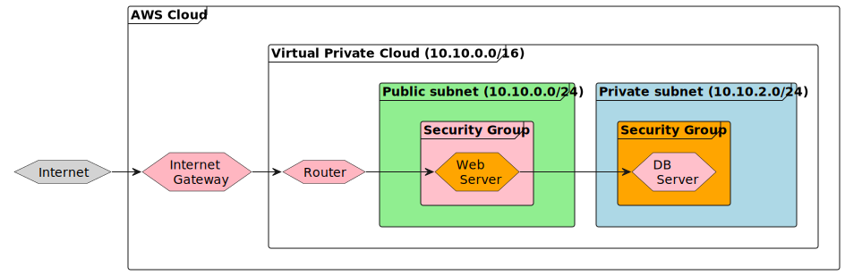

# Networking Concepts

## Target
Troubleshoot and deploy a fix for the connection problem between the WebServer (10.10.0.10) and the DBServer (10.10.2.10) over port 3306.

## Diagram



## Analysis

According to the diagram, the following resources are present:

* 1 VPC with CIDR Block is 10.10.0.0/16
* 1 public subnet (with CIDR Block 10.10.0.0/24) and 1 private subnet (with CIDR Block 10.10.2.0/24) inside of that VPC
* 1 Internet Gateway for that VPC and 1 record in Route Table to connect public subnet with internet gateway
* 1 web ec2 instance inside public subnet with a security group will only allow connection via port 80 from 0.0.0.0 
* 1 db ec2 instance inside private subnet with a security group will only allow connection via port 3306 from public subnet

We can make a sample web application to show the connection between web instance and db instance

## Steps

### Add provider

```terraform
# provider.tf
terraform {
  required_providers {
    aws = {
      source  = "hashicorp/aws"
      version = "~> 4.16"
    }
  }

  required_version = ">= 1.2.0"
}

provider "aws" {
  region  = "us-east-1"
}
```

### Add network

Vpc, subnet, internet gateway, route table

```terraform
# network.tf

resource "aws_vpc" "main" {
  cidr_block = "10.0.0.0/16"
  enable_dns_hostnames = true

  tags = {
    Name = "main-vpc"
  }
}

resource "aws_internet_gateway" "main" {
  vpc_id = aws_vpc.main.id

  tags = {
    Name = "main"
  }
}

resource "aws_route_table" "main" {
  vpc_id = aws_vpc.main.id

  route {
    cidr_block = "0.0.0.0/0"
    gateway_id = aws_internet_gateway.main.id
  }

  tags = {
    Name = "main"
  }
}

resource "aws_subnet" "public" {
  vpc_id            = aws_vpc.main.id
  cidr_block        = "10.0.0.0/24"
  map_public_ip_on_launch = true

  tags = {
    Name = "public"
  }
}

resource "aws_subnet" "private" {
  vpc_id            = aws_vpc.main.id
  cidr_block        = "10.0.2.0/24"

  tags = {
    Name = "private"
  }
}

resource "aws_route_table_association" "public_subnet" {
  subnet_id      = aws_subnet.public.id
  route_table_id = aws_route_table.main.id
}

resource "aws_route_table_association" "private_subnet" {
  subnet_id      = aws_subnet.private.id
  route_table_id = aws_route_table.main.id
}
```

### Add necessary variables

```terraform
# variables.tf

variable "ec2_ami_id" {
  type = string
  default = "ami-0b5eea76982371e91" 
  # name: amzn2-ami-kernel-5.10-hvm-2.0.20221210.1-x86_64-gp2
  # desc: Amazon Linux 2 Kernel 5.10 AMI 2.0.20221210.1 x86_64 HVM gp2
}

variable "ssh_public_key_path" {
  type = string
  default = "~/.ssh/id_rsa.pub"
}
```

### Create security group and web instance

Also add key pair to make ssh connection

```terraform
# main.tf
resource "aws_security_group" "web-security-group" {
  name        = "Web-Security-Group"
  description = "Web Security Group"
  vpc_id      = aws_vpc.main.id

  ingress {
    from_port   = 80
    to_port     = 80
    protocol    = "tcp"
    cidr_blocks = ["0.0.0.0/0"]
  }

  ingress {
    from_port   = 22
    to_port     = 22
    protocol    = "tcp"
    cidr_blocks = ["0.0.0.0/0"]
  }

  egress {
    from_port   = 0
    to_port     = 0
    protocol    = "-1"
    cidr_blocks = ["0.0.0.0/0"]
  }


  tags = {
    Name = "Web-Security-Group"
  }
}

resource "aws_instance" "webserver" {
  ami           = var.ec2_ami_id
  instance_type = "t2.micro"
  subnet_id = aws_subnet.public.id
  associate_public_ip_address = true # to generate public ip & dns

  key_name = aws_key_pair.maintainer.id

  user_data = file("${path.module}/web-user-data")

  vpc_security_group_ids = [aws_security_group.web-security-group.id]

  tags = {
    Name = "webserver"
  }
}

resource "aws_security_group" "db-security-group" {
  name        = "Db-Security-Group"
  description = "Db Security Group"
  vpc_id      = aws_vpc.main.id

  ingress {
    from_port   = 3306
    to_port     = 3306
    protocol    = "tcp"
    cidr_blocks = ["10.0.0.0/24"]
  }

  egress {
    from_port   = 0
    to_port     = 0
    protocol    = "-1"
    cidr_blocks = ["0.0.0.0/0"]
  }

  tags = {
    Name = "Db-Security-Group"
  }
}

resource "aws_instance" "dbserver" {
  ami           = var.ec2_ami_id
  instance_type = "t2.micro"
  subnet_id = aws_subnet.private.id

  vpc_security_group_ids = [aws_security_group.db-security-group.id]

  tags = {
    Name = "dbserver"
  }
}

resource "aws_key_pair" "maintainer" {
  key_name   = "maintainer-key"
  public_key = file(var.ssh_public_key_path)
}
```

### Print outputs

```terraform
# outputs.tf

output "webserver_public_dns" {
    value = aws_instance.webserver.public_dns
}

output "webserver_public_ipv4" {
    value = aws_instance.webserver.public_ip
}

output "dbserver_private_ip" {
    value = aws_instance.dbserver.private_ip
}
```

### Provision Infrastructure

* Initialize the Terraform environment and download the provider by running `terraform init`.
* Validate the syntax of your Terraform code by running `terraform validate`.
* Use `terraform plan` to preview the changes that will be made to the infrastructure.
* Apply the changes to the infrastructure by running `terraform apply`.
* View the output of the infrastructure by running `terraform output`.

*You can run the above steps incrementally to see the changes being made as you go.*

### Test connection

* Use public dns of webinstance to check connection to port 80 of web instance
* SSH to web instance and run below command to check connection to port 3306 of db instance

```
nmap -PNp 3306 {private_ip_of_db_instance}
```

### Destroy Infrastructure
Remember to run `terraform destroy` when you are finished to remove all resources on AWS