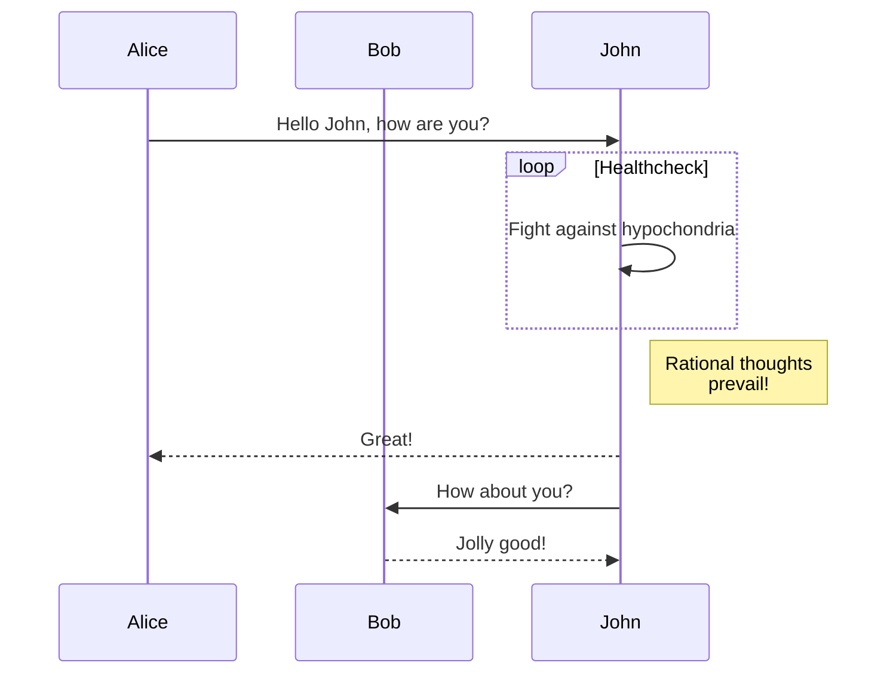

# Cloud Computing Essentials

## Target
Migrate an existing website to static hosting on Amazon S3 in order to improve web application reliability.

## Infra Structure

```plantuml
actor "Island resident" as re
rectangle "Island web portal" as Iwp

cloud "AWS Cloud" {
  
  storage "Amazon S3 \nbucket" as S3
  artifact "Bucket policy" as Bp
  S3 <- Bp 
  
}

S3 <- Iwp: 2. Get Request
S3 --> Iwp: 3. Root Object
Iwp <- re: 1. Visit Portal
Iwp --> re: 4. Wave Info
```

Test mermaid
