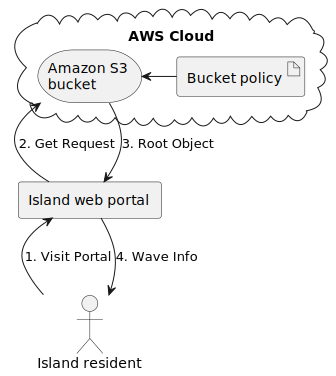

# Cloud Computing Essentials

## Target
Migrate an existing website to static hosting on Amazon S3 in order to improve web application reliability.

## Infra Structure



## Resources
* Amazon S3
* Bucket policy
* Object file
* ...

## How to do it step by step

### 1. Create file structures for terraform
It should have 3 main files:
* main.tf: contains resources
* variables.tf
* outputs.tf

### 2. Create folder `web_resources` and put all lab files there

```
web_resources/
  index.html
  main.js
  policy.txt
  styles.css
  target-file.csv
```

### 3. Setup AWS Access key and secret key
* Create key on AWS website
* Run command to export variables
```
export AWS_ACCESS_KEY_ID=<your_access_key>
export AWS_SECRET_ACCESS_KEY=<your_secret_key>
```

### 4. Setup AWS Provider
```terraform
# main.tf
terraform {
  # https://registry.terraform.io/providers/hashicorp/aws/latest/docs
  required_providers {
    aws = {
      source  = "hashicorp/aws"
      version = "~> 4.16"
    }
  }

  required_version = ">= 1.2.0"
}

provider "aws" {
  region  = "us-west-1"
  # access key and secret key will be read automatically by environment variables: AWS_ACCESS_KEY_ID, AWS_SECRET_ACCESS_KEY
}
```

### 5. Create your bucket
Also
* Define ownership rule of objects
* Unblock public access
```terraform
# main.tf
# https://registry.terraform.io/providers/hashicorp/aws/latest/docs/resources/s3_bucket
resource "aws_s3_bucket" "mybucket" {
  bucket = "my-bucket-ceca403b-25a1-46f7-be20-495a3619e521"

  tags = {
    Name        = "My bucket"
    Environment = "Dev"
  }
}

# https://registry.terraform.io/providers/hashicorp/aws/latest/docs/resources/s3_bucket_acl
resource "aws_s3_bucket_acl" "main_acl" {
  bucket = aws_s3_bucket.mybucket.id
  acl    = "private" # See https://docs.aws.amazon.com/AmazonS3/latest/userguide/acl-overview.html#canned-acl
}

# https://registry.terraform.io/providers/hashicorp/aws/latest/docs/resources/s3_bucket_public_access_block
resource "aws_s3_bucket_public_access_block" "main" {
  bucket = aws_s3_bucket.mybucket.id

  block_public_acls       = false
  block_public_policy     = false
  ignore_public_acls      = false
  restrict_public_buckets = false
}
```

### 6. Setup encryption for objects
```terraform
# https://registry.terraform.io/providers/hashicorp/aws/latest/docs/resources/s3_bucket_server_side_encryption_configuration
resource "aws_s3_bucket_server_side_encryption_configuration" "main" {
  bucket = aws_s3_bucket.mybucket.bucket

  rule {
    apply_server_side_encryption_by_default {
      sse_algorithm     = "AES256"
    }
  }
}
```

### 6. Upload objects
```terraform
# https://registry.terraform.io/providers/hashicorp/aws/latest/docs/resources/s3_object
resource "aws_s3_object" "index_file" {
  bucket = aws_s3_bucket.mybucket.id
  key    = "index.html"
  source = "${path.module}/web_resources/index.html"
  content_type = "text/html" 
  # the default content_type is binary/octet-stream so when we view it, 
  # browser will download it instead of display the file. 
  # So you have to set content_type correctly
}

resource "aws_s3_object" "main_js" {
  bucket = aws_s3_bucket.mybucket.id
  key    = "main.js"
  source = "${path.module}/web_resources/main.js"
  content_type = "application/javascript"
}

resource "aws_s3_object" "styles_css" {
  bucket = aws_s3_bucket.mybucket.id
  key    = "styles.css"
  source = "${path.module}/web_resources/styles.css"
  content_type = "text/css"
}

resource "aws_s3_object" "target_file_csv" {
  bucket = aws_s3_bucket.mybucket.id
  key    = "target-file.csv"
  source = "${path.module}/web_resources/target-file.csv"
}
```

### 6. Setup static website hosting and output endpoint
```terraform
# main.tf
# https://registry.terraform.io/providers/hashicorp/aws/latest/docs/resources/s3_bucket_website_configuration
resource "aws_s3_bucket_website_configuration" "main" {
  bucket = aws_s3_bucket.mybucket.bucket

  index_document {
    suffix = "index.html"
  }
}
```

```terraform
# outputs.tf
output "website_endpoint" {
    value = aws_s3_bucket_website_configuration.main.website_endpoint
}
```

### 6. Setup bucket policy
* Create `s3_policy.json` file from `web_resources/policy.txt` file, and replace `Your_Bucket_ARN` with `${bucket_arn}` so we can pass bucket ARN to policy later.
```json
{
  "Id": "StaticWebPolicy",
  "Version": "2012-10-17",
  "Statement": [
    {
      "Sid": "S3GetObjectAllow",
      "Action": [
        "s3:GetObject"
      ],
      "Effect": "Allow",
      "Resource": "${bucket_arn}/*",
      "Principal": "*"
    }
  ]
}
```

* Create policy resource
```terraform
# main.tf
# https://registry.terraform.io/providers/hashicorp/aws/latest/docs/resources/s3_bucket_policy
resource "aws_s3_bucket_policy" "static_web_policy" {
  bucket = aws_s3_bucket.mybucket.id
  policy = templatefile(
    "${path.module}/s3_policy.json",
    {
      bucket_arn = aws_s3_bucket.mybucket.arn
    }
  )
}
```

### 6. Create Infra
* Run `terraform init` to init terraform environment and download provider
* Run `terraform validate` to validate syntax
* Run `terraform plan` to see what will be changed in infrastructure
* Run `terraform apply` to make change in infrastructure
* Run `terraform output` to see the output of infra. Here we will see the endpoint of website, we can take that endpoint, go to browser and view the website.

*You can run after each step to enjoy the incremental change*

### 7. Destroy Infra
* Do not forget to run `terraform destroy` to destroy all resources on AWS after you are done with it.


### 8. Improve
You can use upload multiple files in a folder one time instead of uploading each file individually with following method.
```terraform
# https://developer.hashicorp.com/terraform/language/meta-arguments/for_each
resource "aws_s3_bucket_object" "test" {
  for_each = fileset(path.module, "**/*.txt")

  bucket = aws_s3_bucket.test.bucket
  key    = each.value
  source = "${path.module}/${each.value}"
}
```
