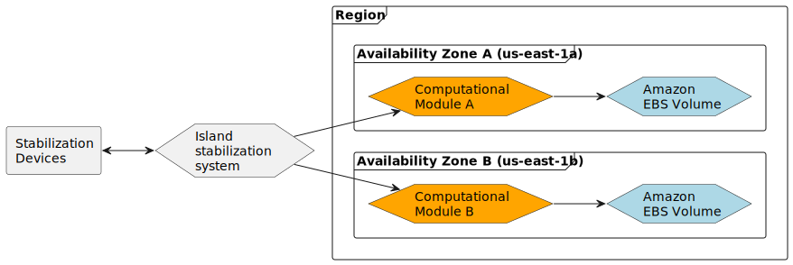

# Cloud First Steps

## Target
Create Amazon EC2 instances to run the computational modules for the island stabilization system.
Each instance should be placed in a different Availability Zone the the same Region.

## Infra Structure

