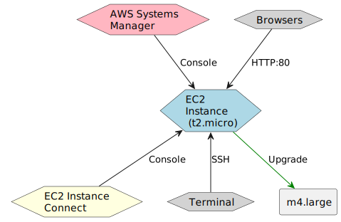

# Computing Solutions

## Target
Test the connection options to access Amazon EC2 instances and change the instance family for the existing Amazon EC2 instance to a large (m4.large) general purpose instance

## Diagram



## Analysis

The setup for `AWS Systems Manager` is too complicated, so I will skip this one.

For SSH connect, we will need to attach an `aws_key_pair` to ec2 instance.

For Browsers, we need to setup `httpd` for ec2 instance so when we connect to ipv4 or dns domain of instance, it can show the information of instance.

For EC2 Instance Connect, we have to make sure that ec2 instance in a public subnet and can be connected to the internet.

## Steps

### Reuse the `user-data` file from Cloud First Steps challenge

```
lab_files\
    user-data
```

### Create variables for terraform

```terraform
#variables.tf
variable "ec2_type" {
  type = string
  default = "t2.micro"
}

variable "ec2_ami_id" {
  type = string
  default = "ami-0b5eea76982371e91" 
  # name: amzn2-ami-kernel-5.10-hvm-2.0.20221210.1-x86_64-gp2
  # desc: Amazon Linux 2 Kernel 5.10 AMI 2.0.20221210.1 x86_64 HVM gp2
}

variable "ssh_public_key_path" {
  type = string
  default = "~/.ssh/id_rsa.pub"
}
```

### Setup provider

```
# main.tf
terraform {
  # https://registry.terraform.io/providers/hashicorp/aws/latest/docs
  required_providers {
    aws = {
      source  = "hashicorp/aws"
      version = "~> 4.16"
    }
  }

  required_version = ">= 1.2.0"
}

provider "aws" {
  region  = "us-east-1"
}
```

### Reuse default VPC and subnet

With default VPC, `Internet Gateway` and `Route table` will be automatically created.
```terraform
# main.tf
resource "aws_default_vpc" "default" {
  tags = {
    Name = "Default VPC"
  }
}

resource "aws_default_subnet" "default" {
  availability_zone = "us-east-1a"

  tags = {
    Name = "Default subnet for us-east-1a"
  }
}
```

### Create aws_key_pair to instance can be connected by ssh

```terraform
# main.tf
resource "aws_key_pair" "maintainer" {
  key_name   = "maintainer-key"
  public_key = file(var.ssh_public_key_path)
}
```

### Create instance
```terraform
# main.tf
resource "aws_instance" "webserver" {
  ami           = var.ec2_ami_id
  instance_type = var.ec2_type
  subnet_id = aws_default_subnet.default.id
  associate_public_ip_address = true
  key_name = aws_key_pair.maintainer.id

  user_data = file("${path.module}/lab_files/user-data")


  tags = {
    Name = "webserver"
  }
}
```

### Reuse and update default security group for ec2 instance

To allow ssh and http connection to ec2 instance.
```terraform
# main.tf
resource "aws_default_security_group" "default" {
  vpc_id = aws_default_vpc.default.id

  ingress {
    from_port   = 22
    to_port     = 22
    protocol    = "tcp"
    cidr_blocks = ["0.0.0.0/0"]
  }

  ingress {
    from_port   = 80
    to_port     = 80
    protocol    = "tcp"
    cidr_blocks = ["0.0.0.0/0"]
  }

  egress {
    from_port   = 0
    to_port     = 0
    protocol    = "-1"
    cidr_blocks = ["0.0.0.0/0"]
  }
}
```

### Print dns domain and ipv4 output

```terraform
# outputs.tf
output "webserver_public_dns" {
    value = aws_instance.webserver.public_dns
}

output "webserver_public_ipv4" {
    value = aws_instance.webserver.public_ip
}
```

### Provision Infrastructure

* Initialize the Terraform environment and download the provider by running `terraform init`.
* Validate the syntax of your Terraform code by running `terraform validate`.
* Use `terraform plan` to preview the changes that will be made to the infrastructure.
* Apply the changes to the infrastructure by running `terraform apply`.
* View the output of the infrastructure by running `terraform output`.

*You can run the above steps incrementally to see the changes being made as you go.*

### Test connection

* Use ipv4 or dns domain, enter into browser and access the webpage. You will see the basic information of ec2 instance.
If you want to view any meta data of ec2 instance, you can edit `user-data` file and run `terraform apply` again to see updated result.

* Use ipv4 or dns domain, open terminal and connect to instance by ssh

```
ssh ec2-user@<ipv4 or dns domain>
```

* Open AWS Console webpage, open EC2 page, choose active running instance, click Connect. In the first tab `EC2 Instance Connect`, click `Connect` and you will be able to connect to instance

# Upgrade instance

Change value of variable `ec2_type` to `m4.large` and run `terraform apply` to upgrade.

### Destroy Infrastructure
Remember to run `terraform destroy` when you are finished to remove all resources on AWS